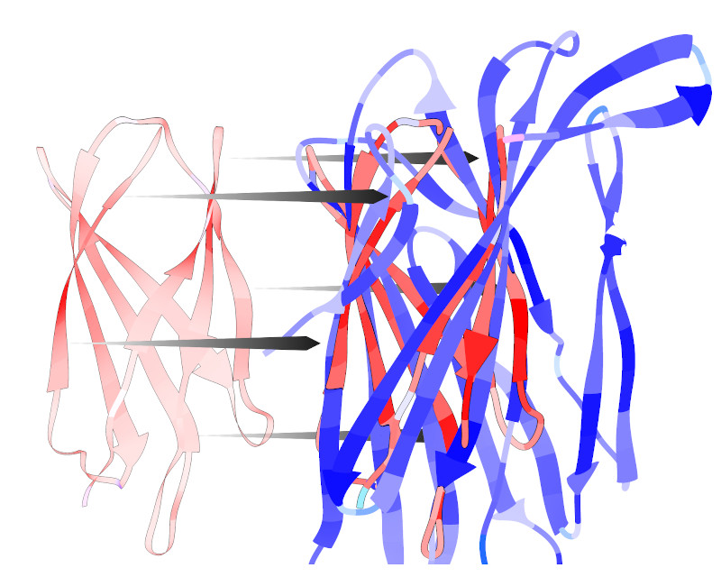
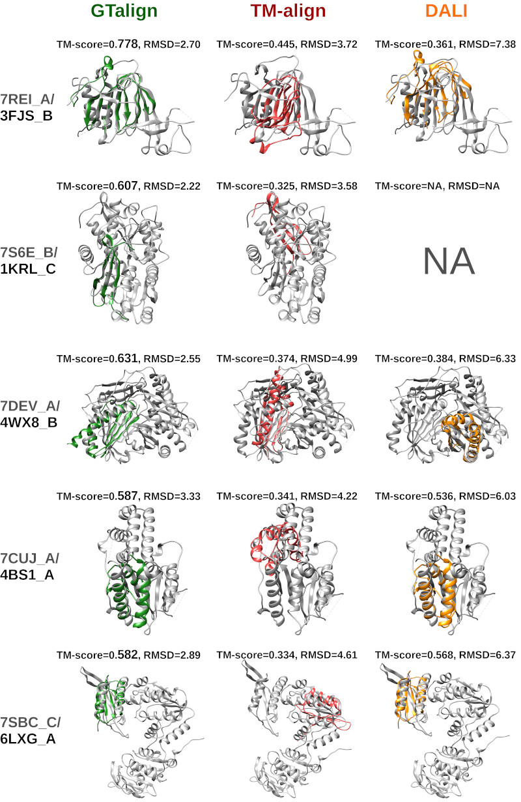

[](https://github.com/minmarg/gtalign_alpha/releases)

*3BV8\_A and 1D8J\_A (colored; left and right, respectively) superimposed on 
7CZ9\_B (grey). Green, GTalign superposition; red, TM-align superposition. 
The GTalign output file for this example is available 
[Here](out/2021-09-18_00000039_1__0.md).*

# GTalign (alpha release)

GTalign, a novel high-performance computing (HPC) protein structure alignment, 
superposition and search method.

## Features

  *  CPU/multiprocessing version
  *  Graphics processing unit (GPU) version
  *  Configurable GPU memory
  *  Utilization of multiple GPUs
  *  Tested on NVIDIA Pascal (GeForce GTX 1080MQ), Turing (GeForce RTX 2080Ti, GTX 1650), 
  Volta (V100), Ampere (A100), and Ada Lovelace (GeForce RTX 4090) GPU architectures
  *  Same executable for different architectures
  *  ~1000x faster on a single GPU (Volta) than TM-align (tested with 186 queries and 
  18,861 database entries)
  *  Fast prescreening for similarities in both **sequence** and **structure** space (further n-fold speedup for database searches)
  *  Alignment of complexes up to 65,535 residues long; the alignment of 37,860 
  residue-long complexes (7A4I and 7A4J) is ~900,000x faster (Volta) than TM-align
  *  Running on Ampere is 2x faster than on Volta
  *  Running on Ada Lovelace is ~1.5x faster than on Ampere
  *  More sensitive and better accuracy (optimality; on average) compared to TM-align 
  when using deep superposition search
  *  Correct TM-scores are guaranteed for produced superpositions
  *  Correct RMSDs are guaranteed for produced alignments
  *  Many options for speed-accuracy tradeoff
  *  Support for PDB, PDBx/mmCIF, and gzip (thanks to [zlib](https://github.com/madler/zlib))
  formats
  *  Reading (un)compressed structures from TAR archives 
  *  Directories for search up to 3 levels deep can be specified

## Future features

  *  Further improvements in speed and accuracy (superposition optimality)
  *  Cross-platform support

  The source code will be published later.

## A note on speed

  The execution time is estimated to be ~6 min for searching 36 million ESM protein
  structures with an average-length (320) protein on a single GeForce RTX 4090 
  using the setting for the fastest search (`--speed=13`).

  The estimate is made for uncompressed structures or when using 48-64 CPU 
  threads for reading and decompressing (option `--cpu-threads-reading`).
  Decompression by 32 CPU threads is ~3x slower than the massive structure 
  comparison on GeForce RTX 4090.

## A note on the CPU/multiprocessing version

  GTalign is optimized to run on GPUs. Its CPU/multiprocessing version is 
  based on the algorithms developed for GPUs, but the implementation details 
  differ. The CPU/multiprocessing version produces similar results, but 
  superpositions and alignments produced for some structure pairs may be 
  different. TM-scores and RMSDs are correct within numerical error.

  The CPU/multiprocessing version using 20 threads is 10-20x slower than the 
  GPU version running on V100. The difference also depends on the options used:
  It increases with decreasing `--speed` value.

## Available Platforms

  The GTalign executable is provided for the following platform:

  *  Linux x64

## System requirements (GPU version)

  *  CUDA-enabled GPU(s) with compute capability >=3.5 (released in 2012)
  *  NVIDIA driver version >=418.87 and CUDA version >=10.1

## System requirements (CPU/multiprocessing version)

  *  GLIBC version >=2.16

## Installation

  Download the executable `bin/gtalign` (or `bin/gtalign_mp` for CPU/multiprocessing 
  version) and change permissions once downloaded: `chmod ug+x bin/gtalign`.

  Alternatively, clone the repository: 

  `git clone https://github.com/minmarg/gtalign_alpha.git`

## Getting started

  Type `bin/gtalign` (or `bin/gtalign_mp`) for a description of the 
  [options](out/gtalign_options.md). 

  Query structures and/or directories with queries are specified with the option `--qrs`.
  Reference structures (to align queries with) and/or their directories to be 
  searched are specified with the option `--rfs`.

  Note that GTalign reads `.tar` archives of compressed and uncompressed structures,
  meaning that big structure databases such as AlphaFold2 and ESM archived structural
  models are ready for use once downloaded.

  Here are some examples:

`gtalign -v --qrs=str1.cif.gz --rfs=my_huge_structure_database.tar -o my_output_directory`

`bin/gtalign -v --qrs=struct1.pdb --rfs=struct2.pdb,struct3.pdb,struct4.pdb -o my_output_directory`

`bin/gtalign -v --qrs=struct1.pdb,my_struct_directory --rfs=my_ref_directory -o my_output_directory`

`bin/gtalign -v --qrs=str1.pdb.gz,str2.cif.gz --rfs=str3.cif.gz,str4.ent,my_ref_dir -s 0 -o mydir`

  Queries and references are processed in chunks.
  The maximum total length of queries in one chunk is controlled with the option 
  `--dev-queries-total-length-per-chunk`. 
  The maximum length of a reference structure can be specified with the option 
  `--dev-max-length`.
  Larger structures will be skipped during a search.
  A good practice is to keep `--dev-max-length` reasonably large (e.g., <10000; unless your 
  set of references are all larger) so that many structure pairs are processed in parallel.

  For comparing protein complexes, it usually suffices to set `--ter=0`.

## Several examples


*Note: Superpositions for DALI were produced from DALI alignments using TM-align. 
Relatively high RMSD values indicate inaccurately aligned fragments.*

## Citation

If you use this software, please cite:

```bibtex
@software{Margelevicius_GTalign_alpha_2023,
  author = {Margelevicius, Mindaugas},
  title = {{GTalign, HPC protein structure alignment, superposition and search (alpha release)}},
  url = {https://github.com/minmarg/gtalign_alpha},
  version = {0.7.0},
  year = {2023}
}
```

## Contacts

Bug reports, comments, suggestions are welcome.
If you have other questions, please contact Mindaugas Margelevicius at
[mindaugas.margelevicius@bti.vu.lt](mailto:mindaugas.margelevicius@bti.vu.lt).

## License

Copyright 2023 Mindaugas Margelevicius, Institute of Biotechnology, Vilnius University

[Licensed](LICENSE.md) under the Apache License, Version 2.0 (the "License"); you may not 
use this file except in compliance with the License. You may obtain a copy of the 
License at

[http://www.apache.org/licenses/LICENSE-2.0](http://www.apache.org/licenses/LICENSE-2.0)

Unless required by applicable law or agreed to in writing, software distributed under the 
License is distributed on an "AS IS" BASIS, WITHOUT WARRANTIES OR CONDITIONS OF ANY KIND, 
either express or implied. 
See the License for the specific language governing permissions and limitations under the 
License.

## Funding

This project has received funding from the Research Council of Lithuania (LMTLT; Grant No. S-MIP-23-104).

